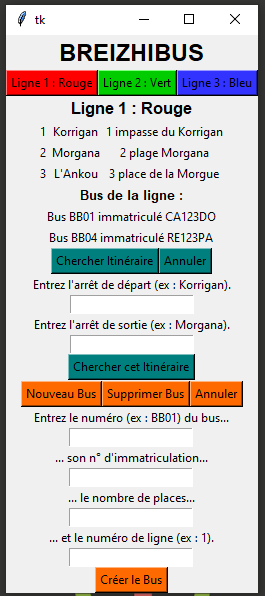

# Breizhibus

Breizhibus connecte à une base de données MySQL de lignes de bus. Il crée une fenêtre avec le module tkinter où il affiche :

-Des boutons correspondant au nombre de lignes sur le réseau. Lorsque l'un de ces boutons est cliqué, il affiche la ligne correspondante, avec ses arrêts et ses bus.

-Un bouton de choix d'itinéraire avec départ et arrivée (ne marche pas encore). Un autre bouton permet d'annuler la demande.

-Un bouton d'ajout d'un bus en base avec des entrées pour les détails, et un de suppression d'un bus existant. Là encore, un bouton d'annulation de la procédure en cours existe.

## Principales difficultés

-Prise en main du module tkinter, avec l'implantation de nombreux éléments. Chaque bouton demande sa propre insertion et un renvoi à une fonction à définir. L'ensemble doit être visible dans le code.

-La suppression des éléments d'un cadre lors d'une nouvelle requette par bouton. Mes premiers essais ne faisaient que surimposer les nouveaux résultats sur les ancients. Résolu avec des boucles du style suivant (merci à Pereg pour l'info) :

  for widget in cadre_insertion.winfo_children():
    widget.grid_forget()

-Les subtilités des requettes par connecteur MySQL, qui demandent souvent des syntaxes précises comme :

  self.curseur.execute("DELETE FROM bus WHERE numero = %s", (numero_bus, ))
